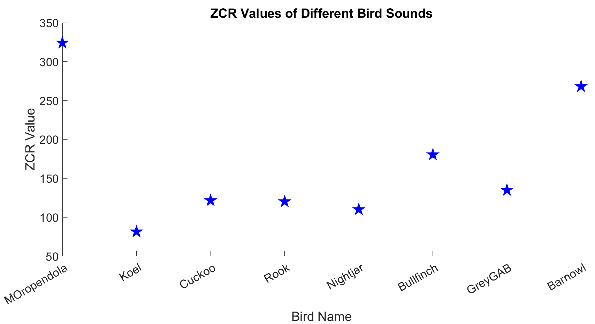
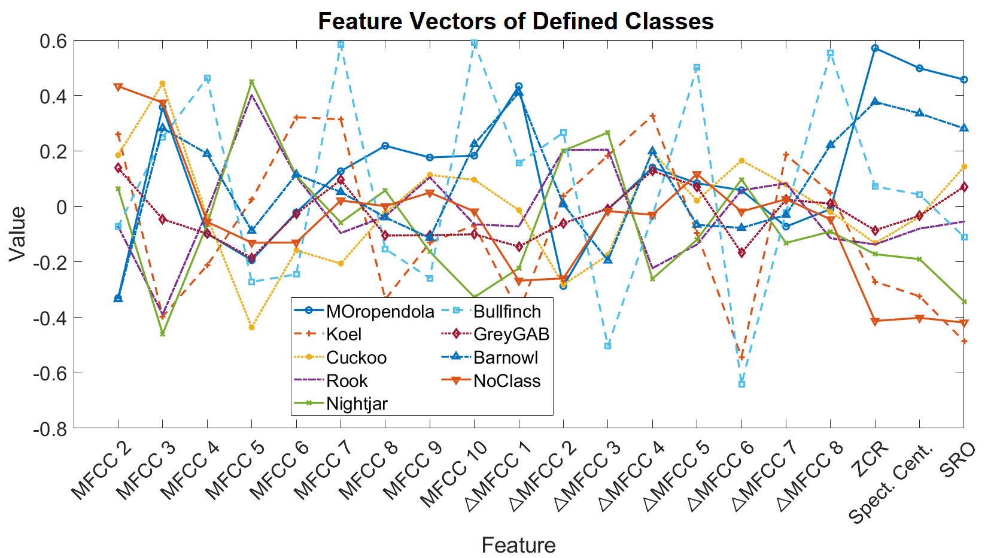

# Real-Time Bird Sounds Classification Using Signal Processing and Machine Learning Techniques

## Abstract
Birds play an important role in the ecological cycle of a forest. Monitoring bird populations can reveal crucial insights about the environment. Continuous identification and monitoring of bird sounds have enabled researchers to track bird populations and assess environmental hazards such as forest fires, droughts, and deforestation. 

This project classifies eight bird species using audio features, with Mel Frequency Cepstral Coefficients (MFCCs) as the primary feature. Additional time-domain and frequency-domain features are also utilized. The feature extraction and classification processes are implemented on a Digital Signal Processor (DSP) board. Real-time sound capturing, feature extraction, and classification results are presented, using an online dataset replayed at varying distances from the microphone to simulate real-world conditions.

---

## Features Used
The following features are extracted for bird sound classification:
- **Zero Crossing Rate (ZCR)** (Time domain)
- **Mel Frequency Cepstral Coefficients (MFCCs)** (Frequency domain)
- **Spectral Centroid** (Frequency domain)
- **Spectral Roll-off** (Frequency domain)

---

## System Specifications
| **Specification**             | **Details**                  |
|--------------------------------|------------------------------|
| **Training platform**          | MATLAB                       |
| **Testing platform**           | TMS320C6713 DSP Board        |
| **ADC resolution**             | 16-bit                       |
| **ADC reference voltage**      | ±3.3V                        |
| **Variable type**              | 32-bit float                 |
| **Sampling frequency**         | 16 kHz                       |
| **Audio channels**             | Mono                         |
| **Frame size**                 | 512 samples (32 ms)          |
| **Frame overlapping**          | 25% (128 samples: 8 ms)      |
| **Window type**                | Hamming                      |
| **FFT points**                 | 512                          |
| **Classifier**                 | Softmax Regression           |
| **Microphone type**            | Condenser                    |
| **Total classes**              | 9                            |
| **Total bird species**         | 8                            |
| **Dataset size**               | 90 files                     |
| **Files per class**            | 10                           |
| **File duration**              | 2–5 seconds                  |

---

## Dataset
The audio dataset employed for training and testing is sourced from publicly available online repositories. For real-time testing, the audio files are replayed at various distances from the microphone connected to the DSP board. We have picked eight bird species namely: **Montezuma Oropendola, Koel, Cuckoo, Rook, Nightjar, Bullfinch, Grey goaway-bird, and Barn Owl**.

---

## Feature Graphs

---

## Results

The classifier accuracy for each bird species at varying distances between the microphone and the sound source is summarized below:

| **Bird Species**          | **0 cm** | **50 cm** | **100 cm** |
|---------------------------|----------|-----------|------------|
| Montezuma Oropendola      | 100%     | 100%      | 84%        |
| Koel                      | 100%     | 100%      | 100%       |
| Cuckoo                    | 100%     | 100%      | 100%       |
| Rook                      | 100%     | 100%      | 100%       |
| Nightjar                  | 100%     | 100%      | 0%         |
| Bullfinch                 | 100%     | 100%      | 100%       |
| Grey go-away-bird         | 100%     | 100%      | 100%       |
| Barn Owl                  | 100%     | 100%      | 100%       |

The accuracy highlights the effectiveness of the classifier under varying conditions. Notably, the performance for the **Nightjar** species at a 100 cm distance dropped significantly, indicating potential challenges in capturing its sound at longer distances.

## Link to Report
For more details follow this link:
[FYP Report PDF](https://drive.google.com/file/d/13eJ0UiFhMFCfzR7BSdSnQwxalj1m_epC/view?usp=sharing)
